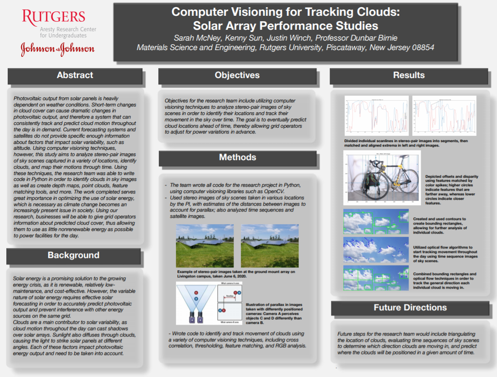

## Undergraduate Researcher: Aresty Research Center for Undergraduates at Rutgers University
I was selected to research the use of computer visioning techniques for tracking cloud movement as a part of the 2020 Aresty Summer Science Program. Over the course of eight weeks, I wrote tools for feature matching, RGB analysis, thresholding, and creating disparity maps and point clouds. Attached is the final research poster I created and presented in front of over 100 members of the Rutgers community. 

